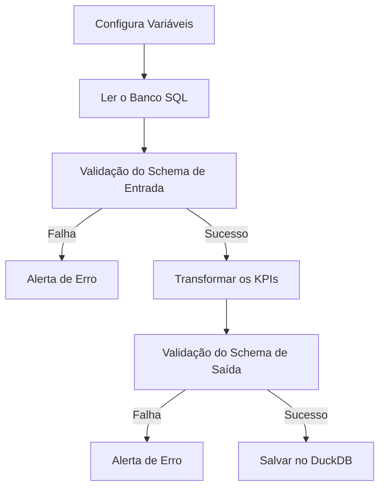

# Documentação Data Quality

## Fluxo

Para desenvolver o desafio de negócio, vamos montar a seguinte ETL:

# Contrato de Dados

::: app.schema.ProdutoSchema

# Transformacoes

## Configurar Variáveis
::: app.etl.load_settings

## Ler o Banco SQL
::: app.etl.extrair_do_sql

## Transformar os KPIs
::: app.etl.transformar

## Salvar no Duckdb
::: app.etl.load_to_duckdb
